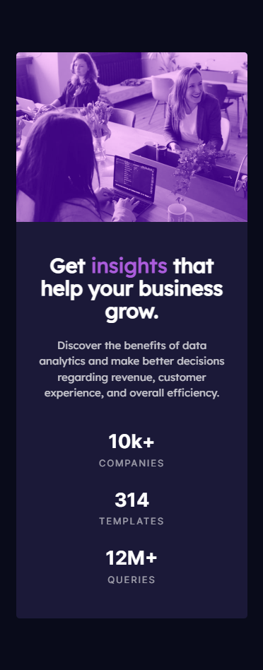
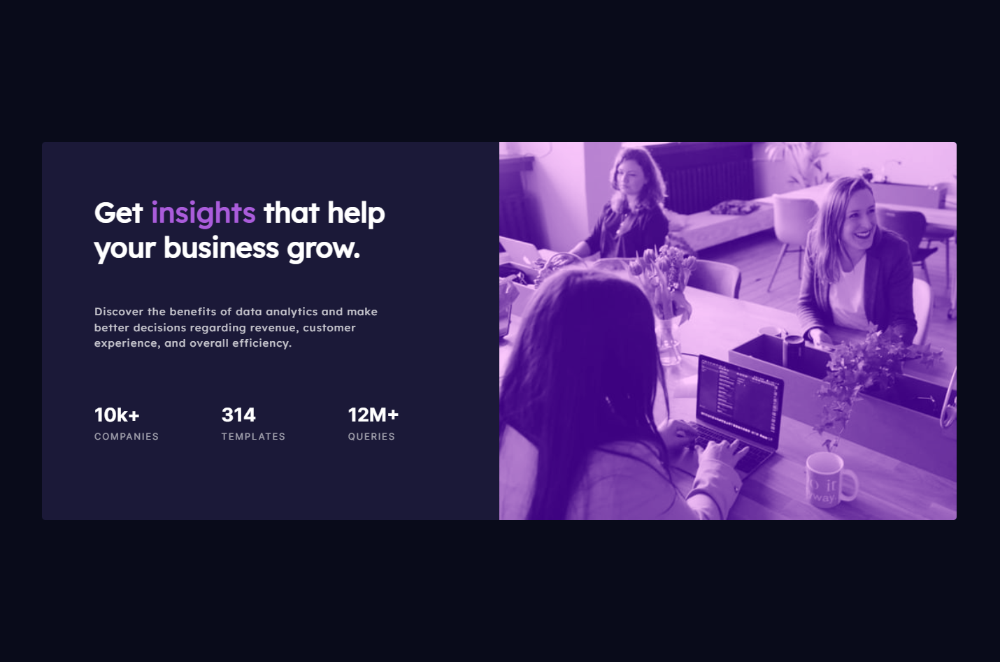

# Frontend Mentor - Stats preview card component solution

This is a solution to the [Stats preview card component challenge on Frontend Mentor](https://www.frontendmentor.io/challenges/stats-preview-card-component-8JqbgoU62). Frontend Mentor challenges help you improve your coding skills by building realistic projects. 

## Table of contents

- [Overview](#overview)
  - [The challenge](#the-challenge)
  - [Screenshot](#screenshot)
  - [Links](#links)
- [My process](#my-process)
  - [Built with](#built-with)
  - [What I learned](#what-i-learned)
- [Author](#author)

## Overview

### The challenge

Users should be able to:

- View the optimal layout depending on their device's screen size

### Screenshot

### Links

- Solution URL: [Add solution URL here](https://www.frontendmentor.io/solutions/blending-modes-grid-flex-qGXX5Y8DNM)
- Live Site URL: [Add live site URL here](https://pr3t0r.github.io/stats-preview-card-component-main/)

## My process

### Built with

- VSCODE
- CSS custom properties
- without framework
- Mobile-first workflow
- CSS grid
- CSS flexbox
- media queries
- eye sighting (no exact sizes were available except paragraphs) 

### What I learned

IMG / background blending modes

## Author

- Frontend Mentor - [@Pr3t0r](https://www.frontendmentor.io/profile/Pr3t0r)

